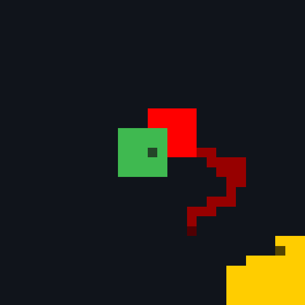
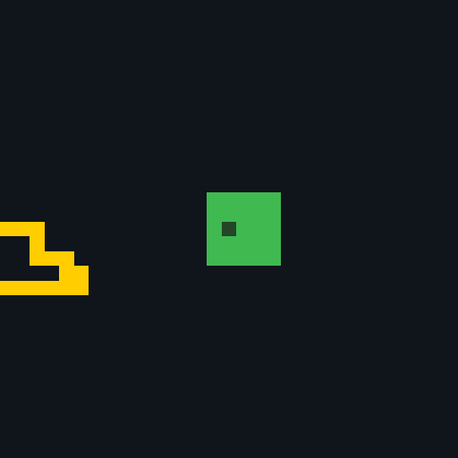
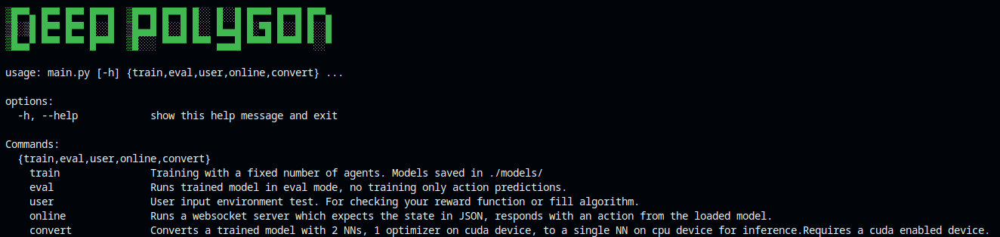
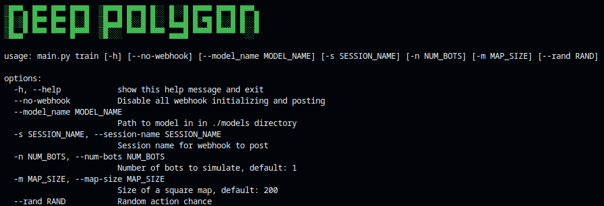
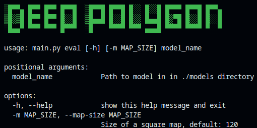

<h1 align="center">Deep Polygon</h1>

A multi-agent deep reinforcement learning experiment - designing collaborative and competitive agents for grid based arena environments like splix.io, paper.io and tileman.io.

## Showcase

<table>
    <tr>
        <td>Aggressive</td>
        <td>Balanced</td>
        <td>Defensive</td>
    </tr>
    <tr>
        <td></td>
        <td></td>
        <td></td>
    </tr>
    <tr>
        <td>Prioritize kills</td>
        <td>Land capture and low risk kills</td>
        <td>Prioritize land capture, avoid combat</td>
    </tr>
</table>

## Overview

  
Table of Contents

  <ol>
    <li><a href="#reinforcement-learning">Reinforcement learning</a></li>
    <li><a href="#environment">Environment</a></li>
    <li><a href="#strategy">Strategy</a>
      <ul>
        <li><a href="#secondary-strategies">Secondary Strategies</a></li>
      </ul>
    </li>
    <li>
      <a href="#getting-started">Getting Started</a>
      <ul>
        <li><a href="#prerequisites">Prerequisites</a></li>
        <li><a href="#installation">Installation</a></li>
        <li><a href="#usage">Usage</a></li>
      </ul>
    </li>
    <li><a href="#roadmap">Roadmap</a></li>
  </ol>

This repository has two main components: deep reinforcement learning algorithms and the grid environment.

## Environment

- Agents control a character in a grid-based map and aims to own as much land as possible by capturing it with their trail.
- An agent can kill other agents (including themselves) by colliding with any of their trail segments.

Agents are rewarded for their current land area and each player kill.

## Reinforcement Learning

### Reward Function

A simple model function is ideal in RL since it leaves more creativity for the AI's behaviour, and is also less computationally expensive - important if it's run each step of the game (for every tile moved).

### Spawn Conditions
A player spawns in a 5x5 area of their own land.

### Model Design
A CNN is required for the AI to have spatial understanding - to avoid enemies and maximize the area captured by its path.

Several scalar inputs are also useful, to pass continuous values which vary within a range, or discrete values (flags or states we can enumerate). This can be used to force certain behaviour.

### State Design
The game grid is viewed as an image with 3 color channels. 

- The 1st channel represents the state of the grid - empty, player block or enemy block. Up to `n` unique enemies can be represented (a configurable parameter) within the player's FOV at any instance. 
- The 2nd channel represents the trail/path taken by the player.
- The 3rd channel represents the trail/path of the (up to) `n` enemies simultaneously.

### Limitations
Training a CNN requires a much larger training set. In RL this would require gathering more state transition tuples or simply experiencing the game for longer.

## Strategy

There are three primary play styles which arise from these rules - the *primary* AIs.

- **Aggressive** - optimize for player kills over survival and land capturing.
- **Balanced** - capture land while capitalizing on opportunities for kills and avoiding unnecessary risk.
- **Defensive** - optimize for land capture, ignoring player kills and any danger.

However, these classes can be expanded on with new gameplay objectives.

### Secondary Strategies

- #### Targeting
    Given the position of a mobile target (player or position), attempt to achieve a goal. The target may be outside of the FOV.

    - **Assassin**
        - hunt down the target player, optimally paths towards the target with land capture
        - ignore other enemy players
        - avoid death from excessive risk
        - kills the target with a high risk, sacrificial playstyle

    - **Defender**
        - optimally paths towards the target
        - when target is found, nearby enemies are fought while ensuring the target is still protected

- #### Units

    A group of agents which must maintain a formation to ensure an objective/prevent a failure condition.

    - **Guardian Formation**
        - Defenders surround their target to prevent their death at all costs.
        - Has multiple **Defender** agents and must coordinate with other defenders and enemy Guardian formations.

- #### Land Manipulation

    Capturing all of an enemy's land renders them vulnerable and reduces their score.

    - **Consumer**
        - Specifically captures enemy land, optimally pathing to enemy area
        - ignores other players

## Getting Started

This simulation can be run to train AIs.

### Prerequisites
- Docker
- A GPU which can be exposed using `--gpus` with `docker`. Read more [here](https://docs.docker.com/engine/containers/resource_constraints/#gpu).

### Usage

`./run-offline-nvidia.sh` is the entrypoint script and passess all arguments to `main.py`.

- `./run-offline-nvidia.sh`

- `./run-offline-nvidia.sh train`

- `./run-offline-nvidia.sh eval`

